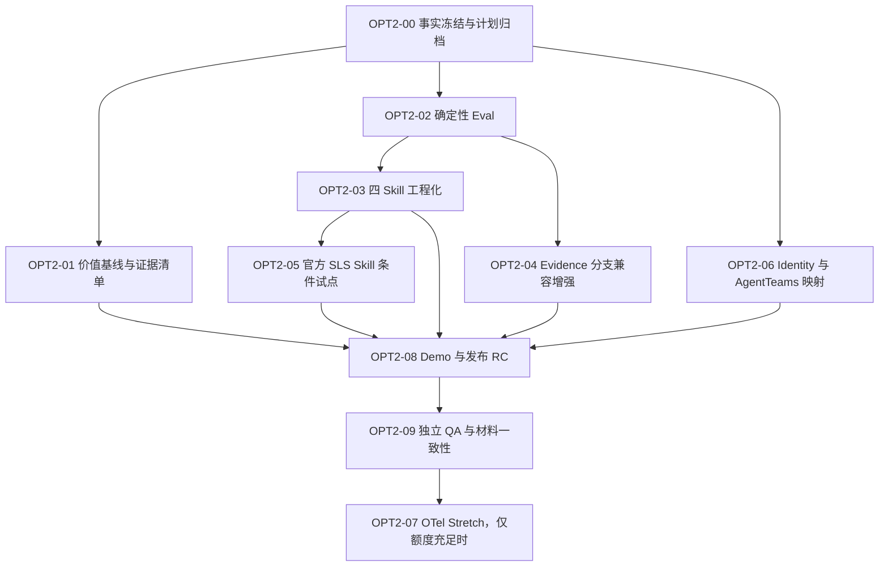

# SecTrace 第二阶段优化总计划

状态：`APPROVED_FOR_REVIEW`（尚未授权实施）
计划版本：`2.0.0`
适用项目：SecTrace 安全事件多 Agent 协同审计系统
目标窗口：GOAI 初赛提交前
权威入口：本目录；临时下载目录中的旧计划不再作为执行依据。

## 1. 执行结论

第二阶段不重做已完成的四 Agent、六 MCP 工具、审批门、持久化状态机和哈希账本。工作的核心从“继续堆功能”调整为：

1. 先修正仓库与材料中的事实漂移和证据断链。
2. 建立可量化、可复现的确定性评测基线。
3. 把现有四个 Skill 工程化为有版本、Schema、质量门和回滚说明的资产。
4. 在不改变现有公开 Contract、六工具清单和 canonical ledger 顺序的前提下，增强 Evidence 不足/冲突时的 fail-closed 分支。
5. 在条件满足时，只接入一个阿里云官方只读 Skill，优先选择日志查询类能力。
6. 补齐 AgentTeams 映射、机器可读 Agent Identity、评委证据索引和演示材料。
7. OpenTelemetry 和大幅 UI 改造均为 stretch goal，不进入初赛前硬承诺。

## 2. 当前基线

### 2.1 已完成且必须保留

- 四个生产角色：Commander、Evidence、Response、Audit。
- 六个 MCP 工具，名称以 `src/app/mcp_adapter.py` 的 `TOOL_NAMES` 为唯一事实源。
- 五个共享 typed Contract：`IncidentCase`、`EvidenceItem`、`ResponsePlan`、
  `ApprovalRecord`、`AuditBundle`；Audit 角色在 `AuditBundle` 上派生
  `AuditReview`。
- Matrix 人工审批来源校验、trace/plan 绑定和非 caller 自证。
- canonical ledger、terminal hash、原子状态持久化、重启加载语义校验和篡改 fail-closed。
- Manager route-only 边界；Manager 不拥有 SecTrace MCP 工具。
- synthetic/de-identified-only、安全建议不执行、`ResponsePlan.status != executed`。
- 已接受的 clean live trace 及历史失败记录。它们不可改写、不可复用为新验证。

### 2.2 本轮只读复核结果

- `code` preflight：`READY_CODE`。
- 本计划形成时的完整测试为 `122 passed`（point-in-time）。OPT2-00
  候选工作树在新增两项 release-documentation 门禁和一项项目元数据门禁后为
  `125 passed`；后者 supersede 前者作为当前候选基线。正式发布仍必须基于冻结
  RC 再重跑并生成唯一事实数字。
- 当前运行时和 live Matrix 状态：未在本计划阶段检查；历史 PASS 不能替代当前 preflight。

### 2.3 当前真实缺口

- 没有正式的确定性 Eval harness、指标定义和版本化报告。
- 四个现有 Skill 缺少统一 `SKILL.md`、I/O Schema、SemVer、CHANGELOG、发布/回滚和质量门。
- 阿里云官方用云 Skill 尚未实际接入。
- Evidence 不足/冲突尚未形成完整、明确、可评测的非线性分支。
- 没有正式 telemetry/OTel、成功率/时延/成本看板。
- Web Demo 主要是按钮和 JSON，评委阅读成本较高。
- Agent Identity 主要存在于材料表格和平台资源中，缺少统一机器可读清单。
- 部署仍依赖手工准备 AgentTeams、Matrix、Docker/MCP 环境。

## 3. 不可破坏的设计约束

1. 不增加、重命名或删除现有六个 MCP 工具，除非另开兼容性 ADR 和迁移票据。
2. 第一阶段异常分支不得向 canonical ledger 插入新事件类型。当前加载器验证精确阶段顺序，直接新增 `evidence.assessment.*` 或 re-analysis 事件会破坏现有防篡改状态机。
3. 第一阶段不改变公开 Contract 字段；新增判断优先作为内部派生值或独立 Eval 输出。
4. unresolved Evidence 不得生成可审批 ResponsePlan；拒绝必须发生在写入前，且不得留下部分状态。
5. 不覆盖、删除或“修复”历史失败、污染 trace 和 append-only state。
6. live 验证必须使用新的合法 `run_id` 和 distinct trace，并分别取得发送、人工审批及运行时 mutation 授权。
7. 05 只写 `docs/verification/`，不写业务代码、Eval 实现或生成逻辑。
8. 01–04 分别维护自己角色的代码、Skill、测试和 Handoff；shared contract、registry、集成、状态与 Git 由 00 负责。
9. submission 继续作为本地参赛包，不默认进入公开仓库。
10. 不将未运行的能力、外部平台能力或下一阶段计划描述成当前已实现事实。

## 4. 统一启动、协作与授权协议

### 4.1 每个新会话必须先做

1. 读取根 `AGENTS.md`、本计划及自己的会话任务。
2. 运行最低必要 preflight：
   - 代码/文档：`scripts/sectrace-preflight.ps1 -Mode code`
   - Docker、AgentTeams、MCP：`-Mode runtime`
   - Matrix 或 S01：`-Mode live`
3. 记录 `PLAN_COMMIT`、`BASE_COMMIT`、分支和 `git status --porcelain=v1`。
4. 若发现来源不明或与本 owner 重叠的修改，停止并交给 00 判定。

preflight 只是只读门禁，不是 launcher。启动、停止、重启、配置变更、资源 apply/delete、消息发送/重试、审批、commit 和 push 均需用户对该动作单独明确授权。

### 4.2 并行规则

- 同一时间只允许一个 shared-state/shared-contract writer。
- 01–04 只有在写集完全不重叠、接口已由 00 冻结时才可并行。
- 任何跨 owner 问题只写 Handoff，不越权修改。
- 每个开发任务必须先 RED 后 GREEN；05 在 owner Handoff 完成后独立复现。
- 00 集成时不得把来源不明或未经 QA 的改动一起暂存。

### 4.3 完成报告统一格式

```text
STATUS:
PLAN_COMMIT:
BASE_COMMIT:
FINAL_COMMIT: <hash or NO_COMMIT>
FILES_CHANGED:
HANDOFF:
TESTS_RUN:
TEST_RESULT:
NEW_BEHAVIOR:
UNCHANGED_SAFETY_BOUNDARIES:
KNOWN_LIMITATIONS:
NEXT_HANDOFF:
```

## 5. 执行路线图



## 6. 任务明细

### OPT2-00：事实冻结、证据修复与计划归档

负责人：00；05 独立复核。
优先级：P0；阻塞全部后续发布。

工作范围：

- 将本计划、评分映射和会话清单作为仓库权威文档。
- 拉取远端后核对默认分支、许可合并状态、HEAD 和 clean baseline；本地 `origin/main` 可能过期，不凭旧 ref 下结论。
- 修复以下事实漂移：
  - `requirements.md` 和旧 T-05 Handoff 的 “exactly five” 与真实六工具不一致。
  - README、submission 和验证记录中 114/122 的分叉；以 RC 实跑值为准。
  - 被最终 PASS 引用但不存在的 `S-09-codex-security-scan.md` 与 `R-08BG-clean-s01-final-closure.md`：恢复脱敏原始证据，或将引用改到真实存在且等价的权威记录；禁止伪造。
  - 旧 Handoff 的“仍等待 QA/仍需 reconciliation”尾状态应标明被后续 PASS supersede，但保留历史结论。
  - `hiclaw/sectrace-agents/README.md` 的未来时描述。
  - `pyproject.toml` 的 `0.0.0` / “Planned” 元数据与当前发布状态。
- 建立单一 `release-facts` 草案，记录工具名、测试数、状态、证据来源与限制。

验收：

- code preflight 通过。
- repository hygiene、完整 pytest、`git diff --check` 和 `git diff --cached --check` 通过。
- 文档内无本机绝对路径、旧工具别名、悬空证据引用或未经验证的能力声明。
- 05 只写独立 QA 记录。

### OPT2-01：场景价值基线与评委证据清单

负责人：00；需要用户补充业务输入。
优先级：P0；直接覆盖“场景价值与行业可复制性”。

工作范围：

- 定义一个清晰用户旅程：安全事件进入、证据分析、建议生成、人工审批、独立审计。
- 记录当前人工聊天/表格方式的步骤基线；如果没有真实企业数据，只使用合成演练并明确限制。
- 定义可验证目标，不虚构生产收益：
  - trace 完整率；
  - 审批绑定正确率；
  - 异常状态拒绝率；
  - 审计链完整率；
  - E2E 耗时分布；
  - 人工交接步骤数。
- 建立 `competition-evidence-manifest`，把每项对外声明链接到测试、verification 或脱敏 live 证据，并标注 point-in-time/非当前运行态限制。
- 给出行业迁移矩阵：不变核心（Contract、gate、ledger、Audit）与需替换适配层（数据源、角色 prompt、审批身份源、网关）。

用户需补充：

- 项目是从零开发还是基于既有项目；团队成员与新增贡献边界。
- 是否有可公开的人工流程基线或演练耗时；没有则明确采用合成基线。
- 对外展示的团队名称、仓库 URL 和报名信息。

验收：所有数字可复算，所有声明有来源，无法验证的内容写为目标而非成绩。

### OPT2-02：确定性 Eval harness

负责人：00 实现；01–04提供角色 oracle；05 独立 QA。
优先级：P0。

建议产物：

- `evaluation/dataset.json`
- `evaluation/runner.py`
- `evaluation/metrics.py`
- `evaluation/schema/*.json`
- `tests/evaluation/`
- 稳定报告写入 `docs/verification/`；高频生成物按发布决策选择是否跟踪。

数据集：

- 复用 S01–S24，但先解决既有 expected 语义歧义，不允许根据 scenario_id/title/expected 写 oracle 分支。
- 至少包含 normal、insufficient、conflicting、invalid approval、tampered ledger 五类 case。
- 明确 provenance/corroboration 信号，避免相同语义输入得到互相冲突的预期。

每个指标必须声明：

- `applicable_cases`
- `numerator`
- `denominator`
- `zero_denominator_policy`
- `evidence_source`
- `failure_class`

首版指标：

- scenario run rate
- expected risk/terminal accuracy
- trace continuity rate
- stage-order validity rate
- approval binding rate（只统计有计划且要求审批的 case）
- ledger integrity rate（按 trace）
- fail-closed rejection rate
- branch gate accuracy

门禁：首版不用 LLM-as-Judge；固定排序、固定数据集版本、非 0 失败码、JSON 与 Markdown 报告一致。

### OPT2-03：四个 Skill 工程化与版本生命周期

负责人：01 Intake、02 Evidence、03 Response、04 Audit；00 维护 registry；05 独立 QA。
优先级：P0；最终 Evaluation 章节依赖 OPT2-02。

每个 Skill 产物：

- `SKILL.md`
- `CHANGELOG.md`
- input/output JSON Schema
- Golden/Badcase、失败注入和边界测试
- SemVer、依赖、发布门、回滚说明
- 与现有 Python 函数签名和真实角色权限一致的示例

共享产物：

- 机器可读 Skill registry。
- registry contract test。
- 版本兼容矩阵和发布检查。

边界：不把 Skill 文档写成新的 MCP 工具；不改变六工具清单；不把尚未安装的官方 Skill列为当前能力。

### OPT2-04：Evidence 不足/冲突的兼容增强

负责人：02 Evidence → 00 shared integration → 03 Response → 04 Audit；05 QA。
优先级：P1。只有 OPT2-02 冻结 branch oracle 后开始。

第一张票只实现兼容最小闭环：

- 内部派生 `sufficient | insufficient | conflicting`，不改公开 Contract。
- Evidence 保留 fact/inference/unknown 和 source refs，不用投票掩盖冲突。
- Response 在任何写状态前双重检查；unresolved 返回固定非泄漏错误，不创建 ResponsePlan/Approval/Audit 状态。
- 可选一次 re-analysis：初始分析不计数，首次 unresolved 原子 `0 -> 1`，只允许一次；重启、并发和重复请求不得产生第二次。
- 第一张票不向 canonical ledger 写新事件，不宣称“无 ResponsePlan 的 persisted Audit terminal”已经实现。

如必须实现 blocked → Audit 的持久化分支，另开 schema-v2 ADR，先定义：合法状态边、Approval skipped 语义、Audit 最小输入、迁移、重启和旧 trace 兼容，再由安全 QA 覆盖。不得与第一张票混做。

### OPT2-05：一个阿里云官方只读 Skill 条件试点

负责人：00 做来源审查和集成设计；02 仅接 Evidence 侧适配；05 QA。
优先级：条件 P0。比赛指南对“推荐/使用”的表述存在歧义，初赛最稳妥策略是只接一个。

候选：阿里云官方 `alibabacloud-sls-query`，仅用于只读日志查询和分析。

官方依据：

- [Alibaba Cloud Skills 门户：alibabacloud-sls-query](https://skills.aliyun.com/skills/alibabacloud-sls-query)
- [日志服务 SLS Query Skill 官方说明](https://help.aliyun.com/zh/sls/sls-query-skill-intelligent-log-query-and-analysis)
- [日志服务 SLS 官方文档](https://help.aliyun.com/zh/sls/)

执行分两门：

1. 无凭据门：审查官方 Skill 来源、许可证、命令、权限、依赖和潜在写操作；生成允许操作清单和威胁模型。
2. live 门：只有用户准备 SLS Project、Logstore、索引和最小权限凭据，并单独授权联网/调用后才执行。

约束：

- 凭据只进入本机 CLI/环境配置，不进入仓库、prompt、日志、Matrix 或 ledger。
- 固定 Project/Logstore allowlist、时间窗、行数、超时和输出大小；禁止任意资源和写操作。
- 查询失败 fail-closed；保留 synthetic adapter 作为可复现 fallback。
- 接入后在材料中明确“官方 Skill 负责可选外部只读证据查询，SecTrace 负责治理 Contract、审批与审计”，不夸大为生产 SOC 接入。

若用户在截止前无法提供阿里云资源，则停止 live 集成，保留诚实披露，并向赛事官方确认是否为初赛硬性条件。

### OPT2-06：Agent Identity 与 AgentTeams 显式映射

负责人：00；01–04复核各自角色；05 QA。
优先级：P1。

- 从现有 Agent YAML、prompt 和 submission 表格生成单一机器可读 Identity manifest。
- 字段至少包含 name、role、owner、version、capabilities、inputs、outputs、dependencies、permissions、boundaries、trace policy。
- contract test 验证 manifest 与生产 YAML/prompt、六工具 allowlist、Team 顺序一致。
- 增加 AgentTeams 五项映射：角色编排、任务拆解、上下文传递、协同执行、状态追踪。
- 不引入 DID/A2A 等当前比赛不需要的新协议。

### OPT2-07：最小 OpenTelemetry（Stretch）

负责人：00；05 QA。
优先级：P2；只有全部 P0/P1 通过、距截止仍有缓冲且剩余预算大于 25% 时启动。

- 默认 no-op，可选内存 exporter；不让 exporter 成为业务依赖。
- Agent/Skill/MCP/Approval/Audit span，业务 `trace_id` 只作关联属性。
- 属性 allowlist；不记录事件正文、凭据、审批原文或个人标识。
- exporter 失败不改变安全状态机结果。
- 初赛前不承诺外部 collector、Prometheus、生产 dashboard。

### OPT2-08：评委 Demo、部署体验与发布 RC

负责人：00；05 最终 QA。
优先级：P0 发布门。

最低演示增强：

- 一个页面清楚展示四角色、当前阶段、trace、Evidence、Response pending gate、human approval、Audit/ledger integrity。
- 只展示 synthetic/de-identified 数据和脱敏既有证据；不得为了录制重复发送或审批旧 S01。
- 如需新的 live 录制，必须新 run_id、新 preflight、独立发送和审批授权。

发布顺序：

1. RC0：冻结工程代码 commit并确认 clean。
2. 在 RC0 上运行 full/security/eval/code preflight，生成 release facts draft。
3. 同步 README、本地 submission、PPT/PDF、作品简介和检查清单。
4. 运行材料事实扫描、路径/secret 扫描、链接检查；记录 PPT/PDF 页数和 SHA-256。
5. 用户授权后形成 RC1 文档提交；submission 仍保持本地，除非用户另行决定。
6. 最终 facts 同时记录 RC0、RC1 和 artifact hashes。
7. 在未登录浏览器人工核验 GitHub 默认分支、README、LICENSE 和克隆步骤。

### OPT2-09：独立安全与发布 QA

负责人：05，只写 `docs/verification/`。
优先级：P0。

必须独立验证：

- full pytest、security、hygiene、Eval、diff/staged/untracked 状态。
- 六工具精确名称、Manager route-only、approval verifier、ledger/state-machine 和 no execution 未回归。
- 所有材料中的当前能力、后续计划、测试数字、工具名和官方 Skill状态一致。
- evidence manifest 无悬空引用；历史 FAIL 保留且 superseded 关系清楚。
- 无本机路径、secret、账号标识和临时目录元数据。

## 7. 里程碑与止损

### M0：事实可信

OPT2-00 完成。未达到则停止所有材料扩写。

### M1：可量化

OPT2-01、OPT2-02 完成。若指标定义不稳定，不进入 Skill Evaluation 和 PPT 成绩页。

### M2：可复用

OPT2-03、OPT2-06 完成。若官方 Skill 条件不满足，不阻塞自有 Skill 发布，但必须诚实披露。

### M3：安全增强

OPT2-04 完成最小兼容门即可；schema-v2 分支不是初赛发布前硬要求。

### M4：可提交

OPT2-08、OPT2-09 完成。任何一项核心 claim 无证据即从材料删除或降级为 roadmap。

## 8. 推荐时间与额度分配

以初赛截止前的短窗口为基准：

- 20%：OPT2-00 事实与证据修复。
- 20%：OPT2-01 价值基线与评委证据清单。
- 25%：OPT2-02 Eval。
- 20%：OPT2-03 Skill 工程化。
- 10%：OPT2-05 官方只读 Skill 条件试点或 OPT2-06 Identity。
- 5%：发布缓冲。

OPT2-04、UI 深化与 OTel 只在前述里程碑提前完成时使用缓冲，不得挤占发布 QA。

## 9. 当前应当执行的第一步

下一张实施票应为 `OPT2-00`，只做事实冻结、悬空证据处理、版本/工具/测试数字统一和 release-facts 草案。该票不接运行时、不安装官方 Skill、不修改业务逻辑、不 commit/push，完成后由 05 独立 QA，再决定是否进入 Eval。
