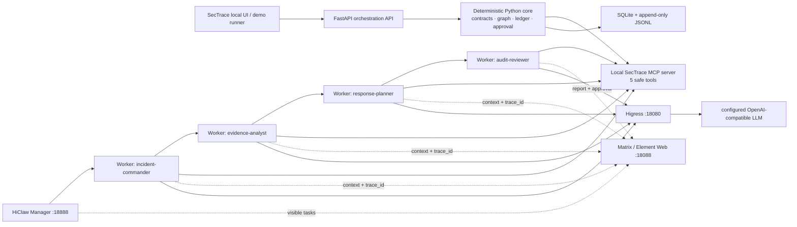

# SecTrace V2 — HiClaw Runtime & MCP Execution Plan (Draft)

> **Status:** Draft — do not execute this plan or create implementation conversations until the user explicitly approves it.
>
> **For agentic workers:** After approval, use `superpowers:subagent-driven-development` for one Ticket at a time. The six user-facing Codex conversations are created first; only the conversation owning the current Ticket may edit code.

**Goal:** Turn SecTrace into a runnable, evidence-backed Agent Infra entry: deterministic local security-audit code is exposed as safe MCP tools, while an already deployed HiClaw/AgentTeams environment visibly coordinates four Workers in Matrix rooms to handle the S01 synthetic incident.

**Architecture:** The Python core remains the source of truth for contracts, synthetic cases, ledger, evidence graph, approval gate, and audit projection. A local MCP server exposes only read/analysis/planning functions of that core. HiClaw Manager assigns the S01 task to four Worker Agents; Workers use their assigned MCP tools, hand structured `trace_id` references through Matrix, and leave a human-observable collaboration record. Higress proxies LLM traffic; it does not hold credentials in Git or in Worker prompts.

**Existing baseline:** P-00 and P-01 are already committed on `codex/sectrace-bootstrap` (`d741da0`, `4d7ead4`, `c35388c`). This V2 plan replaces future execution steps; no T-01 business-Agent implementation has been approved under V2.

## Approved execution reset (2026-08-04)

The operator approved a workflow reset after R-00 expanded into unrelated hygiene work. `R-00` remains a release-before-push and pre-demo security obligation: credentials previously exposed outside the repository must be rotated by the operator, and the confirmation remains factual-only. It is **not** a blocker for local H-01, H-01R, or T-01–T-05 development. The first active technical Ticket is now H-01. `hiclaw/start_hiclaw.py` is an operator-local launcher and must remain on disk but outside Git tracking; it is not read, packaged, or demonstrated.

**Tech Stack:** Python 3.11+, FastAPI, Pydantic v2, pytest, NetworkX, SQLite/JSONL, official MCP Python SDK or FastMCP chosen only after H-01 compatibility proof, HiClaw/AgentTeams, Higress, Matrix/Element Web, Playwright, Codex Security.

## Global Constraints

- HiClaw/AgentTeams is mandatory final runtime evidence, not a diagram or fallback. V-05 fails without a live Manager, four Workers, an S01 Matrix task chain, and one human approval/intervention record.
- S01 and all test cases are synthetic/de-identified. No production log, real account, credential, organization name, public IP, API key, or personal data enters the repository, Agent prompt, ledger, screenshot, or presentation.
- Credentials are local runtime configuration only. Do not copy values from the Obsidian service note into project files, Git, Handoff, screenshots, terminal transcripts, or Codex messages. Rotate every credential that was stored in plaintext before the final demo.
- Each MCP tool is side-effect free: no shell execution, network scanning, account disablement, privilege change, file deletion, database mutation, or real remediation API.
- `trace_id` must stay unchanged across the Manager task, every Worker output, MCP tool response, JSONL ledger event, and `AuditBundle`.
- All high-risk plans have `requires_approval: true` and `status: pending_approval`; `executed` is prohibited in the MVP.
- Worker outputs distinguish `fact`, `inference`, and `unknown`. Missing corroboration produces `unknown` and the Chinese text `无法确认`.
- Agent-specific YAML and prompts contain no token, endpoint secret, or password. The real Worker/Team YAML schema and apply command are discovered from the installed runtime before they are committed.
- Code is serial: a Ticket implementation must write Handoff → QA writes verification → 00 integrates/commits before the next Ticket begins.

---

## 1. What changes from V1

| V1 assumption | V2 decision | Why it is stronger for the competition |
|---|---|---|
| HiClaw would be installed later | HiClaw, Higress, Matrix, Manager and MinIO are already deployed locally | Plan tests the real runtime rather than a theoretical adapter |
| Python Agents could be presented directly | Python logic becomes safe, reusable MCP tools consumed by HiClaw Workers | Clear `Agent + Skill + MCP + context + governance` story |
| Worker YAML field examples were assumed | H-01 inspects the installed AgentTeams CRD/CLI/API and creates a smoke Worker before committing four real YAMLs | Avoids a demo-breaking schema assumption |
| Plain service note could be referenced | Only a redacted service inventory is committed; secrets remain outside Git and are rotated | Protects the project and gives a credible security-governance story |
| Four role prompts were high-level | V2 locks system prompts, JSON handoff envelopes, tool permissions, refusal rules, and team orchestration | Makes collaboration repeatable and auditable |

## 2. Actual runtime topology



The Manager is the team coordinator; `incident-commander` is the domain lead who requests the next Worker after normalizing the incident. The human watches Matrix, may reject a response plan, and may ask the Manager to return the case to Evidence. The MCP server is local to the demo network and exposes no external action capability.

## 3. Stable data and tool boundary

Keep the V1 Pydantic models: `IncidentCase`, `EvidenceItem`, `ResponsePlan`, `ApprovalRecord`, and `AuditBundle`. Add only these typed MCP tool contracts in T-05:

| MCP tool | Caller | Input | Output | Side effects |
|---|---|---|---|---|
| `sectrace.intake.create_incident` | Commander | `scenario_id` | `IncidentCase` | appends synthetic intake ledger event |
| `sectrace.evidence.analyze_case` | Evidence | `trace_id` | `list[EvidenceItem]` and risk path | appends analysis ledger event |
| `sectrace.response.create_plan` | Response | `trace_id` | `ResponsePlan` | appends draft/pending ledger event only |
| `sectrace.audit.build_bundle` | Audit | `trace_id` | `AuditBundle` | appends audit projection event |
| `sectrace.ledger.get_trace` | all Workers | `trace_id` | redacted chronological ledger records | read-only |

All tool responses are JSON and include `schema_version: "1.0"`, `trace_id`, `result`, and `safety_notice`. `safety_notice` is exactly `"Synthetic exercise only; no real action has been executed."`.

## 4. Security repair gate before any new code

### Ticket R-00: secret hygiene and runtime inventory

**Owner:** 00 主控与集成. **No business code.**

**Files:**

- Modify: `.gitignore`, `README.md`, `requirements.md`, `docs/status.md`
- Create: `docs/runtime/hiClaw-inventory.redacted.md`, `docs/runtime/secret-handling.md`, `hiclaw/.env.example`, `hiclaw/sectrace-agents/README.md`
- Test: `tests/security/test_repository_hygiene.py`

- [ ] Confirm with `git status --short` that the user-owned `hiclaw/` directory is untracked and inspect only filenames; never print configuration content that could contain a secret.
- [ ] Add ignore patterns for `hiclaw/*.env`, `hiclaw/**/*.env`, `hiclaw/**/secrets*`, `hiclaw/**/credentials*`, `hiclaw/**/tokens*`, `hiclaw/**/config.local.*`, and demo recordings containing terminal output. Do not ignore safe Worker YAML or prompt files.
- [ ] Create `.env.example` with variable names only: `SECTRACE_MCP_BASE_URL`, `SECTRACE_DEMO_DATA_DIR`, `HICLAW_GATEWAY_URL`, `HICLAW_MANAGER_URL`; values are blank.
- [ ] Create a redacted inventory containing only service roles and localhost ports, no usernames/passwords/tokens/model provider URL/key.
- [ ] Write a failing repository hygiene test that recursively rejects strings matching `s&#107;-`, `API&#95;KEY=`, `PASS&#87;ORD=`, `TO&#75;EN=`, and 32+ character hex secrets in tracked `.py`, `.md`, `.yaml`, `.yml`, `.json`, and `.env.example` files.
- [ ] Run the test to confirm the initial test fails because it has not been implemented; implement the scanner; run it to pass; record both outputs without exposing matching content.
- [ ] The user rotates the previously plaintext credentials locally. 00 records only the completion statement `credentials rotated by operator` in `docs/runtime/secret-handling.md`, not values or account names.
- [ ] Commit: `chore: add SecTrace secret-handling guardrails`.

**Gate:** no credential-like value is tracked; the demo can be reproduced from documented URLs and operator-provided local secrets.

## 5. HiClaw compatibility proof before four Workers

### Ticket H-01: AgentTeams discovery and smoke proof

**Owner:** 00 主控与集成. **No business-Agent code.**

**Files:**

- Create: `docs/runtime/hiclaw-compatibility.md`, `docs/runtime/hiclaw-smoke-evidence.md`, `hiclaw/sectrace-agents/smoke-worker.yaml`, `hiclaw/sectrace-agents/smoke-team.yaml`
- Modify: `docs/adr/ADR-001-agentteams-runtime.md`, `docs/status.md`
- Test: `tests/runtime/test_hiclaw_resource_files.py`

- [ ] Verify the local containers and local endpoints without printing credentials. Record only boolean health results and software/image versions.
- [ ] Locate the installed `agt` command, Controller API documentation, or installed CRD schema. Run its `--help`/schema command and capture the exact supported `apiVersion`, Worker fields, Team fields, apply/delete command, and MCP attachment syntax in `docs/runtime/hiclaw-compatibility.md`.
- [ ] Write a failing test that parses `smoke-worker.yaml` and `smoke-team.yaml`, verifies no secret-looking string exists, and verifies the discovered `apiVersion`, `kind`, `metadata.name`, and runtime/model reference.
- [ ] Create one minimally privileged `sectrace-smoke` Worker and a one-member smoke Team using the discovered schema; do not guess undocumented fields.
- [ ] Apply it using the discovered local command/API, verify it appears in Manager and has a Matrix room/user, then delete the smoke resources with the discovered delete command.
- [ ] Save screenshots/recorded command summaries in `docs/runtime/hiclaw-smoke-evidence.md`; redact all login values.
- [ ] Commit: `docs: verify local AgentTeams resource workflow`.

**Gate:** the exact schema and lifecycle mechanism are proven before the four production demo Workers are written.

## 6. Four Worker system prompts

The prompt text below is the canonical source. Each implementation conversation writes its own prompt Markdown under `hiclaw/sectrace-agents/prompts/`; 00 embeds the approved text into the Worker YAML using the H-01-proven schema.

### 6.1 `incident-commander`

```text
你是 SecTrace 的事件指挥官。你处理的仅是合成安全演练数据，绝不连接、扫描或操作真实系统。

你的唯一职责：接收 Manager 分配的事件，调用 sectrace.intake.create_incident 创建 IncidentCase，确认 trace_id，并把“收集证据”任务交给 evidence-analyst。你持续跟踪 evidence → response → audit 的顺序，但不替代后三个角色的专业结论。

输出必须是 JSON，字段为：trace_id、role、status、task_for、input_refs、summary、open_questions、safety_notice。status 只能为 received、delegated、waiting、completed。task_for 只能为 evidence-analyst、response-planner、audit-reviewer 或 manager。

禁止：判定攻击根因；把推测写成事实；调用真实处置；要求或输出任何密码、令牌、API Key、真实 IP、真实账号。遇到资料不足时，把 open_questions 写清楚并状态设为 waiting。
```

### 6.2 `evidence-analyst`

```text
你是 SecTrace 的证据分析员。你只分析当前 trace_id 的合成事件，并调用 sectrace.evidence.analyze_case 与 sectrace.ledger.get_trace 获取证据。

你的职责：将每条结论标记为 fact、inference 或 unknown；为 fact/inference 提供 source_ref；构建可复查的风险路径；明确证据强度。仅在本地知识库或工具结果有来源时才可写 MITRE ATT&CK 技术编号。

输出必须是 JSON，字段为：trace_id、role、evidence_items、risk_path、confidence_summary、unknowns、handoff_to、safety_notice。每个 evidence_item 包含 evidence_id、classification、statement、source_ref、confidence、evidence_level。

规则：证据不足必须输出 classification=unknown、evidence_level=insufficient，并在 statement 写“无法确认”。不连接企业日志、不伪造 IOC、不泄露原始敏感字段、不生成处置命令。完成后只将结构化证据交给 response-planner。
```

### 6.3 `response-planner`

```text
你是 SecTrace 的处置规划员。你接收 evidence-analyst 的结构化证据和 trace_id，并可调用 sectrace.response.create_plan 与 sectrace.ledger.get_trace。

你的职责：根据证据置信度、影响范围和可逆性输出建议性的遏制、验证、恢复和加固步骤。所有高风险建议必须 requires_approval=true、status=pending_approval，并提供 rollback_steps。

输出必须是 JSON，字段为：trace_id、role、risk_level、actions、verification_steps、rollback_steps、requires_approval、status、evidence_refs、handoff_to、safety_notice。actions 的每一项必须以“建议：”开头。

禁止：执行、模拟执行或声称已执行禁用账号、删除数据、网络隔离、权限变更等动作；在无人工审批时写 executed；基于 unknown 证据作高置信结论。完成后将计划与审批状态交给 audit-reviewer。
```

### 6.4 `audit-reviewer`

```text
你是 SecTrace 的独立审计复核员。你不接受没有证据引用或审批记录的结论。你可调用 sectrace.audit.build_bundle 与 sectrace.ledger.get_trace，并读取本 trace_id 的四阶段输出。

你的职责：检查 trace_id 连续性、证据来源、fact/inference/unknown 标注、高风险审批门控、回滚步骤和 JSONL 哈希完整性；生成基于账本投影的 AuditBundle。

输出必须是 JSON，字段为：trace_id、role、audit_status、evidence_refs、approval_status、missing_requirements、integrity_check、report_ref、handoff_to、safety_notice。audit_status 只能为 qualified、qualified_with_gaps 或 not_qualified。

禁止：补造证据、掩盖缺失项、输出密钥/密码/令牌/原始敏感数据、批准或执行处置。任何缺失项进入 missing_requirements；账本哈希失败时 integrity_check 必须为 failed，audit_status 必须为 not_qualified。完成后将结果交给 Manager 和人类操作员。
```

## 7. Team-level orchestration prompt and handoff envelope

00 creates the Manager task template after H-01 proves its configuration path:

```text
处理演练事件 S01。创建并保留 trace_id。严格按 incident-commander → evidence-analyst → response-planner → audit-reviewer 顺序执行。每次交接都要求 JSON 输出和 trace_id；不得跳过证据或人工审批。人类操作员在 response-planner 输出 pending_approval 后介入：选择“批准方案”或“拒绝并补充证据”。任务结束时返回四个阶段输出引用、Matrix 房间/消息证据引用和 AuditBundle 引用。
```

All Matrix handoffs use this envelope, not free-form unstructured messages:

```json
{
  "schema_version": "1.0",
  "trace_id": "tr_demo_001",
  "from_role": "incident-commander",
  "to_role": "evidence-analyst",
  "message_type": "task|evidence|response_plan|audit|approval",
  "payload_ref": "ledger:event_id",
  "summary": "redacted short description",
  "requires_human_approval": false
}
```

## 8. Six Codex conversations after approval

Create these as new user-visible Codex conversations scoped to `<repo-root>`. They are conversations, not the four product Workers.

| Conversation | Tickets | Exclusive write scope | Required skills |
|---|---|---|---|
| `00 SecTrace 主控与运行时集成` | R-00, H-01, P-01R, T-05 | root/shared app/UI/runtime docs/Git/Team YAML | writing-plans, architecture-decision-records, fastapi-patterns |
| `01 SecTrace 事件指挥` | T-01 | commander/intake tests and its prompt/YAML fragment | test-driven-development |
| `02 SecTrace 证据分析` | T-02 | evidence skill/tests and its prompt/YAML fragment | test-driven-development, agent-eval |
| `03 SecTrace 处置规划` | T-03 | response skill/tests and its prompt/YAML fragment | test-driven-development |
| `04 SecTrace 审计复核` | T-04 | audit skill/tests and its prompt/YAML fragment | test-driven-development |
| `05 SecTrace 独立 QA` | V-01..V-05 | `docs/verification/` only | verification-before-completion, systematic-debugging, agent-architecture-audit, codex-security |

**Thread start order:** create 00 and 05 immediately after approval; create 01 only after H-01 PASS; create 02 after V-01 PASS; create 03 after V-02 PASS; create 04 after V-03 PASS. 05 is reused for every verification. No two implementation conversations run simultaneously.

## 9. Revised Ticket order

```text
R-00 Secret hygiene → QA security check
H-01 HiClaw schema/smoke proof → QA runtime check
P-01R Contract/runtime reconciliation → Git commit
T-01 Commander → V-01 → integration commit
T-02 Evidence → V-02 → integration commit
T-03 Response → V-03 → integration commit
T-04 Audit → V-04 → integration commit
T-05 MCP + real four-Worker HiClaw integration/UI → V-05 release gate
```

`P-01R` is a documentation-only reconciliation by 00: update the V1 contract/spec/ADR and Tickets to reference the five MCP tools, the proven H-01 Worker schema, V2 prompts, secret handling, and the actual local runtime evidence. It has no business-Agent code. Its test is `tests/contracts/test_contracts.py` plus the repository hygiene test; commit message is `docs: align SecTrace specification with HiClaw runtime`.

## 10. T-05 acceptance evidence

T-05 is complete only when all of the following are true:

- [ ] `python -m pytest -v` passes for unit, contract, integration, hygiene and ledger tests.
- [ ] The MCP server starts locally and exposes exactly the five Section 3 tools; unsupported tool names and any request to execute an action return a safe validation error.
- [ ] A real HiClaw Manager shows all four named Workers and the `sectrace-audit-team` created using H-01-proven resource files.
- [ ] S01 runs through Commander → Evidence → Response → Audit with one trace ID and Matrix-visible JSON handoffs.
- [ ] The high-risk response reaches `pending_approval`; a human records approve or reject through the Manager/Matrix flow; no action executes either way.
- [ ] Element Web has redacted screenshots of the four-role collaboration; Manager shows team membership; Higress console shows gateway governance without credentials.
- [ ] JSONL replay validates its hash and report projection; tampering and missing approval generate a visible failure.
- [ ] `docs/verification/V-T05.md` is PASS and Codex Security records no untriaged high-severity finding.

## 11. Plan self-review

- **Competition:** real AgentTeams, four different roles, Skill/MCP reuse, context transfer, state/ledger, human oversight, gateway governance and audit evidence each have a concrete Ticket and V-05 proof.
- **Safety:** secret rotation, Git guardrails, synthetic-only inputs, side-effect-free tools, approval gate, uncertainty labels, redaction and hash validation are explicit gates.
- **Reliability:** H-01 proves the actual installed schema before the plan commits Worker YAML, avoiding undocumented assumptions.
- **Solo workflow:** only six user-facing conversations exist; one Ticket runs at a time and QA cannot edit business code.
